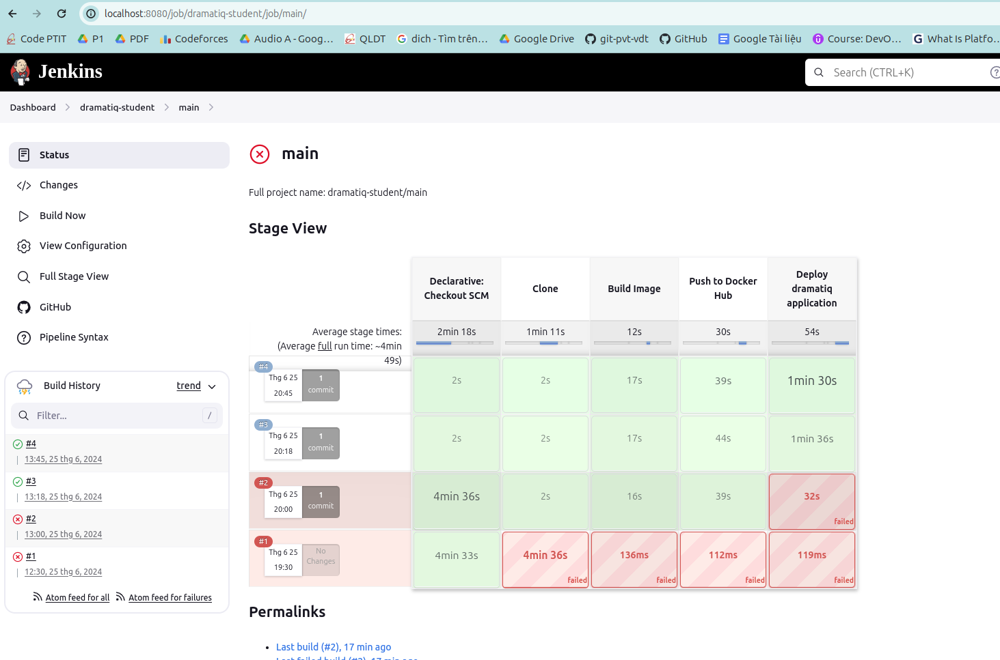

## Cài đặt rabbitmq, dramatiq, apscheduler (python)

Cấu trúc thư mục:

```
.
├── broker.yml
├── docker-compose.yml
├── Dockerfile
├── README.md
├── requirements.txt
├── scheduler.py
└── tasks.py
```

Thư viện cần thiết (requirement.txt)
```
dramatiq
dramatiq[rabbitmq]
apscheduler
requests
tabulate # để log màn hình dạng bảng 
```

#### Chú ý, khi triển khai với docker compose, service dramatiq và scheduler phụ thuộc (depend on) vào service rabbitmq, nhưng chỉ sử dụng depend on là chưa đủ, cần sử dụng thêm healthcheck
Do đó trong Dockerfile phải cài thêm netcat-openbsd

### Kết quả
Truy cập thông qua browswer: (Account: guest/guest)


Đang setup lập lịch 20s thực hiện 1 lần 

Kết quả lấy các đối tượng trong hệ thống (gọi 1 api tới API Service) và hiển thị dạng bảng


## Setup CI/CD

### Sử dụng Jenkins multibranch pipeline



### Sử dụng Ansible trong việc triển khai project lên 1 VM

### Log triển khai Jenkins

[Jenkins log](./logs/jenkins-log.txt)